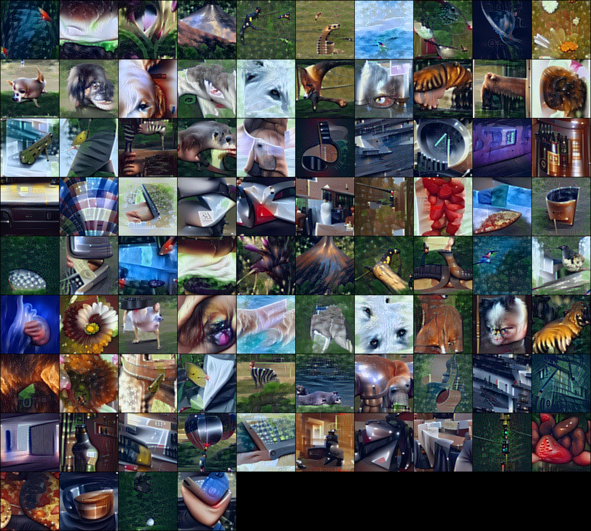

# Intro

Code for the paper:

Dreaming to Distill: Data-free Knowledge Transfer via DeepInversion 
Hongxu Yin, Pavlo Molchanov, Zhizhong Li, Jose M. Alvarez, Arun Mallya, Derek Hoiem, Niraj K. Jha and Jan Kautz 
[arXiv](https://arxiv.org/abs/1912.08795) [PDF](https://arxiv.org/pdf/1912.08795.pdf) [High quality PDF](https://drive.google.com/open?id=1Qgl18wbYmgcSdRdscqZeMCBqS1MFwgw7)

Abstract: We introduce DeepInversion, a new method for synthesizing images from the image distribution used to train a deep neural network. We 'invert' a trained network (teacher) to synthesize class-conditional input images starting from random noise, without using any additional information about the training dataset. Keeping the teacher fixed, our method optimizes the input while regularizing the distribution of intermediate feature maps using information stored in the batch normalization layers of the teacher. Further, we improve the diversity of synthesized images using Adaptive DeepInversion, which maximizes the Jensen-Shannon divergence between the teacher and student network logits. The resulting synthesized images from networks trained on the CIFAR-10 and ImageNet datasets demonstrate high fidelity and degree of realism, and help enable a new breed of data-free applications - ones that do not require any real images or labeled data. We demonstrate the applicability of our proposed method to three tasks of immense practical importance -- (i) data-free network pruning, (ii) data-free knowledge transfer, and (iii) data-free continual learning.

## How to run:
This snippet will generate 84 images by inverting resnet50 model from torchvision package.

`python main_imagenet.py --bs=84 --do_flip --exp_name="test_rn50_3" --r_feature=0.01 --arch_name="resnet50" --fp16 --verifier`

Parameters:

- `bs` - batch size, should be close to original batch size during training, but not necessary.
- `do_flip` - will do random flipping between iterations
- `exp_name` - name of the experiment, will create folder with this name in `./generations/` where intermediate generations will be stored after 100 iterations
- `r_feature` - coefficient for feature distribution regularization, might need adjustment for other networks
- `arch_name` - name of the network architecture, should be one of pretrained models from torch vision package: `resnet50`, `resnet18`, `mobilenetv2` etc. Code also supports resnet50v1.5 model which gives better image quality (can be downloaded from [here](https://drive.google.com/open?id=1zTHgCSbapEBYY_XCa-SRSPR0Jl8wkxJC), needs to be in `./models/resnet50v15/` and argument needs to be `resnet50v15`)
- `fp16` - enables FP16 training, will use FP16 training equivalent to AMP O2 level
- `verifier` - enables checking accuracy of generated images with `mobilenetv2` network after each 100 iterations. Useful to observe generalizability of generated images.

After 3k iterations (~6 mins on V100) generation is done: `Verifier accuracy:  98.8%` and a grid of images look like:

Large dataset of images inverted from ResNet50v1.5 model: [Nvidia Google Drive](https://drive.google.com/open?id=1AXCW6_E_Qtr5qyb9jygGaLub13gQo10c), best viewed with gThumb, organized by ImageNet classes (description of classes can be found here [link](https://gist.github.com/yrevar/942d3a0ac09ec9e5eb3a))

To generate images without multi-resolution scheme we need to change `setting_id` to `1` when create an instance of DeepInversionClass. 
