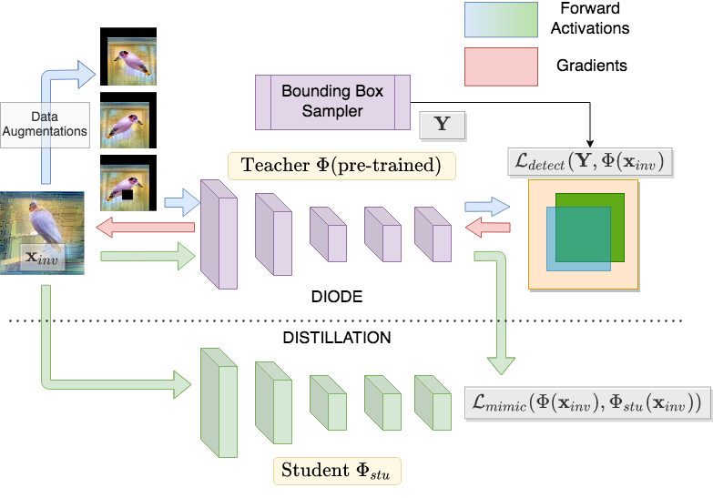
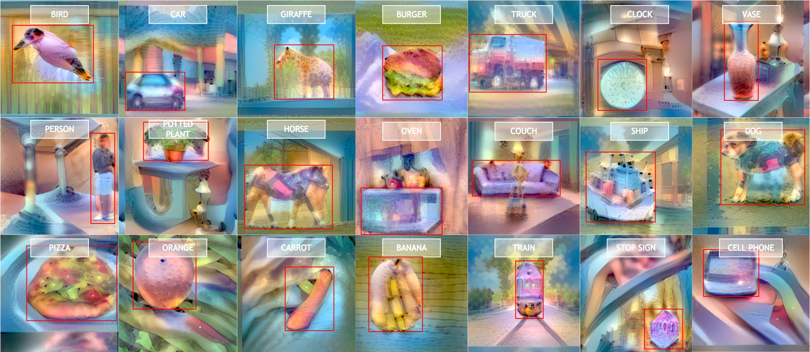

## Introduction

**Data-free Knowledge Distillation for Object Detection**<br>
Akshay Chawla, Hongxu Yin, Pavlo Molchanov and Jose Alvarez<br>
NVIDIA

**Abstract:** We present DeepInversion for Object Detection (DIODE) to enable data-free knowledge distillation for neural networks trained on the object detection task. From a data-free perspective, DIODE synthesizes images given only an off-the-shelf pre-trained detection network and without any prior domain knowledge, generator network, or pre-computed activations. DIODE relies on two key components—first, an extensive set of differentiable augmentations to improve image fidelity and distillation effectiveness. Second, a novel automated bounding box and category sampling scheme for image synthesis enabling generating a large number of images with a diverse set of spatial and category objects. The resulting images enable data-free knowledge distillation from a teacher to a student detector, initialized from scratch. <br>
In an extensive set of experiments, we demonstrate that DIODE’s ability to match the original training distribution consistently enables more effective knowledge distillation than out-of-distribution proxy datasets, which unavoidably occur in a data-free setup given the absence of the original domain knowledge.

_**Todo**_ Please add link to pdf below<br>
[[PDF](www.google.com)]



## Setup environment

Install conda [[link](https://docs.conda.io/en/latest/)] python package manager then install the `lpr` environment and other packages as follows:
```
$ conda env create -f ./docker_environment/lpr_env.yml
$ conda activate lpr
$ conda install -y -c conda-forge opencv
$ conda install -y tqdm
$ git clone https://github.com/NVIDIA/apex
$ cd apex
$ pip install -v --no-cache-dir ./
```

Note: You may also generate a docker image based on provided Dockerfile `docker_environments/Dockerfile`.

## How to run?

This repository allows for generating location and category conditioned images from an off-the-shelf Yolo-V3 object detection model.

1. Download the directory *diode_yolo* from here: **ADD LINK TO UPLOADED DATASET HERE** (234 GB)
2. Copy pre-trained yolo-v3 checkpoint and pickle files as follows:
    ```
    $ cp /path/to/diode_yolo/pretrained/names.pkl /pathto/lpr_deep_inversion/models/yolo/
    $ cp /path/to/diode_yolo/pretrained/colors.pkl /pathto/lpr_deep_inversion/models/yolo/
    $ cp /path/to/diode_yolo/pretrained/yolov3-tiny.pt /pathto/lpr_deep_inversion/models/yolo/
    $ cp /path/to/diode_yolo/pretrained/yolov3-spp-ultralytics.pt /pathto/lpr_deep_inversion/models/yolo/
    ```
2. Extract the one-box dataset (single object per image) as follows: 
    ```
    $ cd /path/to/diode_yolo
    $ tar xzf onebox/onebox.tgz -C /tmp
    ```
3. Confirm the folder `/tmp/onebox` containing the onebox dataset is present and has following directories and text file `manifest.txt`:
    ```
    $ cd /tmp/onebox
    $ ls
    images  labels  manifest.txt
    ```
4. Generate images from yolo-v3:
    ```
    $ cd /path/to/lpr_deep_inversion
    $ chmod +x scripts/runner_yolo_multiscale.sh
    $ scripts/runner_yolo_multiscale.sh
    ```




## Notes:

1. For ngc, use the provided bash script `scripts/diode_ngc_interactivejob.sh` to start an interactive ngc job with environment setup, code and data setup.
2. To generate large dataset use bash script `scripts/LINE_looped_runner_yolo.sh`. 
3. Check `knowledge_distillation` subfolder for code for knowledge distillation using generated datasets.

## Citation

```
@inproceedings{chawla2021diode,
	title = {Data-free Knowledge Distillation for Object Detection},
	author = {Chawla, Akshay and Yin, Hongxu and Molchanov, Pavlo and Alvarez, Jose M.},
	booktitle = {The IEEE/CVF Winter Conference on Applications of Computer Vision (WACV)},
	month = January,
	year = {2021}
}
```

